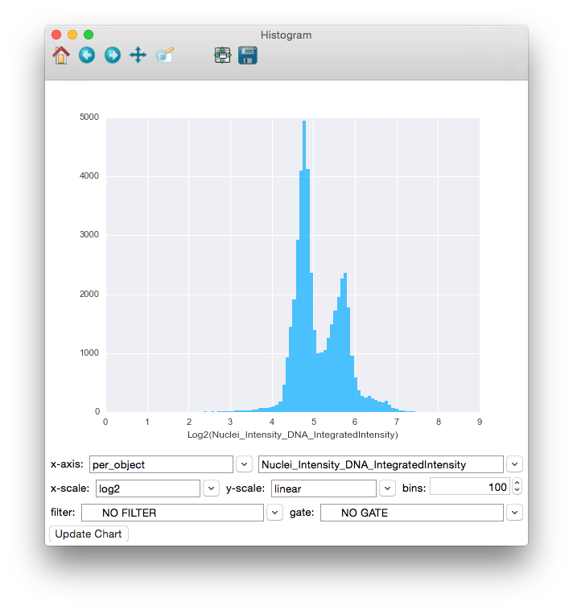

=================
X. Histogram Plot
=================

Launch **Histogram Plot** from the main CPA interface by clicking the button in the toolbar. This
tool allows you to create histogram plots from the numeric columns in your tables.

To use the **Histogram Plot**, simply select the table whose columns you would like to plot from
the table dropdown. Then select a single measurement from that table in the x-axis dropdown
(only numeric columns will be available). You can also enter the number of bins to use. The filter
dropdown can be used to select filters defined in your properties file to limit the points being
plotted. Finally, click the **Update Chart** button to view the plot.

Once data is plotted, you can use the tools provided in the toolbar at the top of the window to
explore the plot. Going backwards from right to left, the tools are as follows:

- **Save**: Clicking this will give you choices for saving the plot as an image.

* **Zoom-to-rect**: This tool may be toggled on and off. When it is on, you can use the mouse to click and drag a rectangle to zoom in on. The extents of the rectangle will become the new extents of the axes. Use the Back button (below) to zoom back out.

- **Pan**: This tool may also be toggled. When on, you can use the mouse to pan the axes by clicking and dragging.

* **Forward** and **Back**: These 2 buttons will redo and undo the zooming and panning actions 38 that you make

- **Home**: This will reset the view to the way it was after Update Chart was pressed.

	Using the Histogram Plot to view the distribution of the Nuclei_Intensity_DNA_IntegratedIntensity measurement, with the x-axis displayed in the log space. The distribution appears to be bimodal, each peak representing an accumulation of cells in different stages of mitosis.
