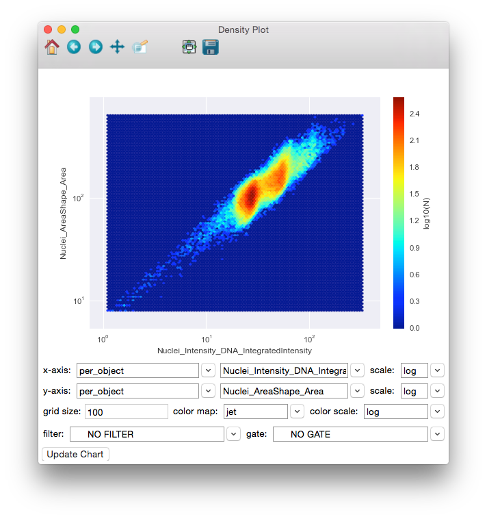

================
XI. Density Plot
================

Launch **Density Plot** from the main CPA interface by clicking the button in the toolbar. This tool
will allow you create density plots from the numeric columns in your tables.

To use the **Density Plot**, simply select the table whose columns you would like to plot from the
table dropdown. Then select the measurements you would like to plot from that table in the xaxis
and y-axis dropdowns (only numeric columns will be available). To view an axis in the log
scale, choose **log** from the x-scale or y-scale dropdown. You may also enter the grid size to use
for binning the data. The grid size is similar to the bins input in the histogram plot except that it
39
is applied along both dimensions, so a grid size of 50 would yield 50x50 points. The filter
dropdown can be used to select filters defined in your properties file to limit the points being
plotted. Finally, click the **Update Chart** button to view the plot. With the plot displayed, you can
change the color map by selecting different maps from the color map dropdown.

Once data is plotted, you can use the tools provided in the toolbar at the top of the window to
explore the plot. Going backwards from right to left, the tools are as follows:

	A density plot of Nuclei_Intensity_DNA_IntegratedIntensity versus Nuclei_AreaShape_Area with log axes, log color  scale, and a grid size of 100.

- **Save**: Clicking this will give you choices for saving the plot as an image.

* **Zoom-to-rect**: This tool may be toggled on and off. When it is on, you can use the mouse to click and drag a rectangle to zoom in on. The extents of the rectangle will become the new extents of the axes. Use the Back button (below) to zoom back out.

- **Pan**: This tool may also be toggled. When on, you can use the mouse to pan the axes by clicking and dragging.

* **Forward** and **Back**: These 2 buttons will redo and undo the zooming and panning actions that you make

- **Home**: This will reset the view to the way it was after Update Chart was pressed.

.. note::
		Update may take a long time for large databases. We are working to improve this performance in later releases.
