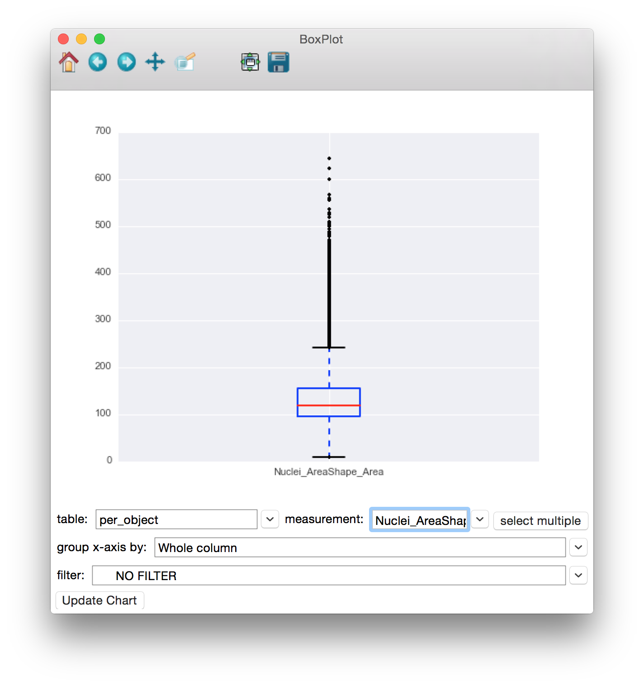

=============
XII. Box Plot
=============

Launch **Box Plot** from the main CPA interface by clicking the button in the toolbar. This tool will
allow you create box and whisker plots from the numeric columns in your tables.

To use the **Box Plot**, simply select the table whose column(s) you would like to plot from the
table dropdown. Then select the measurement you would like to plot from that table in the x-axis
dropdown (only numeric columns will be available). To plot multiple measurements against the
same y-axis, click the **Select Multiple** button to the right of the x-axis dropdown. You will be
presented with a checklist of columns to include in the plot. The filter dropdown can be used to
select filters defined in your properties file to limit the points being plotted. Finally, click the
**Update Chart** button to view the plot.

The bottom and top of the box represent the 25th and 75th percentile of the data, with the median
value represented by a horizontal red line. The whiskers on the top and bottom extend to the
most extreme data point within 1.5 times the upper and lower quartiles. Outliers are
represented individually with “+” shapes.

Once data is plotted, you can use the tools provided in the toolbar at the top of the window to
explore the plot. Going backwards from right to left, the tools are as follows:

* **Save**: Clicking this will give you choices for saving the plot as an image.

- **Zoom-to-rect**: This tool may be toggled on and off. When it is on, you can use the mouse to click and drag a rectangle to zoom in on. The extents of the rectangle will become the new extents of the axes. Use the Back button (below) to zoom back out.

* **Pan**: This tool may also be toggled. When on, you can use the mouse to pan the axes by clicking and dragging.

- **Forward** and **Back**: These 2 buttons will redo and undo the zooming and panning actions that you make

* **Home**: This will reset the view to the way it was after Update Chart was pressed.

	A box plot of Nuclei_AreaShape_Area.
