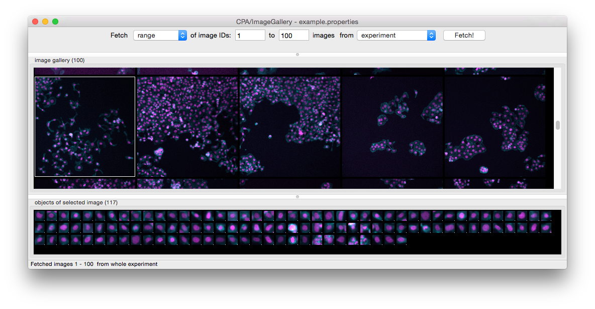

==================
XIV. Image Gallery
==================
Image Gallery provides a convenient gridview allowing an overview of images from the entire experiment. A variety of options are provided to filter images based on experiment-specific metadata, e.g., gene name, compound treatments, etc. Multiple filters can be combined to refine the search. Images can be displayed as a custom-sized thumbnail or in full resolution, and the color assigned to each channel in the image can be customized to highlight structures of interest. Individual segmented cells can be viewed for each image, and can be dragged and dropped into the Classifier window.

Image Gallery consists of a menu bar, an area for the image gallery area, and an area for the objects of segmented image. In the menu bar, you can choose what image you want to fetch. You can choose a range of images based on image ID from the experiment or a filter, all images from the experiment or a filter, or an individual image based on image ID. Once the selection is made, click **Fetch** to load the relevant images.

For each image loaded in the image gallery area, right-click to show the options.
- Select **View full images of selected** or double-click an individual tile to show the object in the context of the image from which it was drawn. This launches the **Image Viewer** tool (section V).
- **Select all/Deselect all** (``ctrl+A/ctrl+D``) selects/deselects all tiles in the bin so they can be dragged and dropped together.
- **Invert selection** (``ctrl+I``) to invert your selection (that is, select all non-selected tiles in the current bin and deselect all selected tiles).
- **Remove selected** (``Delete``) removes the selected tiles from the current bin.
- **Fetch all objects from image** populates the objects of segmented image area below with all objects belonging to the selected image(s).

Images loaded in the area for the objects of segmented image have the same right-click options except for **Fetch all objects from image**. Tiles in this area can be dragged and dropped into the Classifier.

  Image Gallery