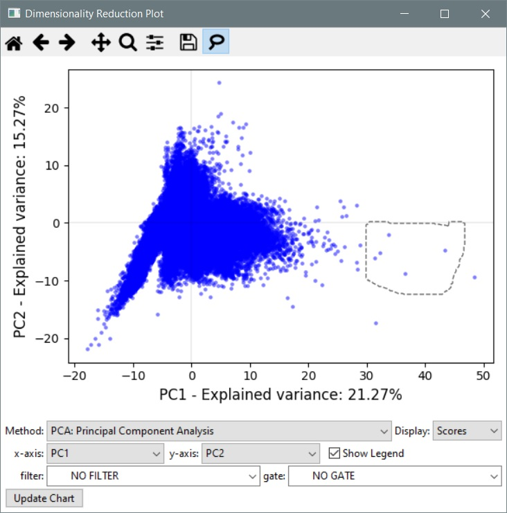

=============================
XVI. Dimensionality Reduction
=============================

Click the **Reduction** button in the main CPA interface toolbar to launch the Dimensionality Reduction tool. This tool
will allow you to perform several reduction methods and visualise the results as a scatter plot.

  Dimensionality Reduction Tool

Dimensionality reduction condenses large numbers of measurements into a more managable number of components, this can
help to visualise results and identify clusters of objects and outliers.

To use the **Dimensionality Reduction Plot**, select a reduction method from the available choices and click
**Update Chart**. The different methods are explained further in the sections below. CPA will normalise measurements
before applying these methods.

The x- and y-axis dropdowns can be used to switch between display of different components on each axis. Click
**Update Chart** after making a selection to display the data.

Displaying "Scores" will show the positions of individual objects from your dataset. Hovering over a
point will display a key for that object in the toolbar. A key of (4, 14) would mean Image #4, Object #14. Some
reduction methods will have the option to display "Loadings", for which the average position of each original
measurement column will be shown on the new axes. Hovering over a loading point will display the measurement name.

Filters can be used to restrict which objects will be displayed on the resulting plot. Note that, due to the nature of
these reduction methods, data from all objects from a dataset will be used to perform the initial reduction.

In the toolbar, you'll also find the **lasso tool**. Activating this will allow you to draw a selection polygon onto
the current plot. Any points within the polygon will be considered as selected. Right-clicking on a plot with an
active selection will produce a popup menu with options to visualise the highlighted objects. If you have a Classifier
tool open, you'll also see the option to *send the selected objects directly to the classifier*.

Reduction Methods
*****************

- **Principal Component Analysis (PCA)**: PCA attempts to generate a series of features which capture the variance of the original dataset. Measurements which vary in the same manner are collapsed towards a single new measurement, termed a *Principal Component*. On the resulting axis labels, CPA will also display the proportion of the original variance which is explained by each principal component. Components are sorted by their contribution to variance, so PC1 will always be the most significant feature.

- **Singular Value Decomposition (SVD)**: SVD is very similar to PCA, but does not center the data before processing. This can be much faster and more memory efficient than PCA when working with very large datasets, but a trade-off is that the resulting components will not be ordered by significance (i.e. PC1 may not be the most important feature).

- **Gaussian Random Projection (GRP)**: This method reduces the dimensionality of the dataset by projecting samples into fewer dimensions while preserving the pairwise distances between them. The random matrix used for projection is generated using a gaussian distribution.

- **Sparse Random Projection (SRP)**: Similar to GRP, but uses a sparse matrix instead of a gaussian one. This can be more memory efficient with large datasets.

- **Factor Analysis (FA)**: Like PCA, Factor Analysis generates a series of components which describe the variance of the dataset. However, with FA the variance in each direction within the input space can be modelled independently.

- **Feature Agglomeration (FAgg)**: This method utilises hierarchical clustering to group together features that behave similarly. The generated clusters can then be treated like components

- **t-Distributed Stochastic Neighbor Embedding (t-SNE)**: t-SNE helps to visualise high dimensional data by giving individual datapoints a coordinate on a 2D map, on which similar points are placed close together. The resulting clusters can help to visualise different object types within a dataset.

