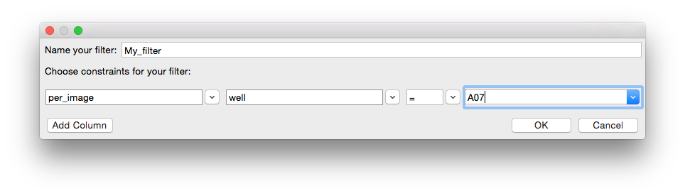
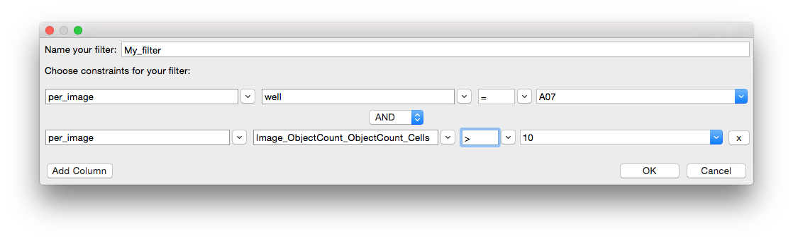

===================================
III. Setting up the properties file
===================================
The properties file is a plain text file that contains the configuration information necessary for CPA to access your data and images. This file can be stored anywhere on your computer. It is selected and loaded upon startup of CPA.

If you use CellProfiler to produce the data to be analyzed in CPA, you can automatically generate a nearly complete properties file with, using the ExportToDatabase module. Otherwise, you can create one manually, referring to the Properties_README or the example provided below as a template.

Each setting in the properties file is stored on a separate line in the form field = value(s), and the order of the settings is not important. Lines that begin with a # are ignored by CPA and may be used for comments. Settings that require a file path may be specified either as absolute or relative to the directory that the properties file is found in.

Note: When editing the properties file, it is important to use an editor that is capable of saving plain text. CPA cannot read files of type .doc, .rtf, etc. We suggest using Notepad on Windows, TextEdit on Mac OS, and Emacs on Linux.

Note: CPA 2.0+ is not compatible with properties files from CellProfiler Analyst version 1.0, but the two formats may be easily converted by hand. Contact us on the CellProfiler forums if you need help with this.

Note: All fields described in the sections below (after the properties file example) are required unless explicitly described as “optional.” In your own properties file, you would replace values surrounded with <> with the relevant information.

III.A Properties file example
=============================

.. code-block:: text

    ==== CPA 3.0 properties file for example dataset ====
    # ==== Database Info ====
    db_type     = sqlite
    db_sql_file = example_SETUP.SQL
    # ==== Table info ====
    image_table  = per_image
    object_table = per_object
    # ==== Column info ====
    image_id   = ImageNumber
    object_id  = ObjectNumber
    plate_id   = plate
    well_id    = well
    cell_x_loc = Nuclei_Location_CenterX
    cell_y_loc = Nuclei_Location_CenterY
    # ==== Image access info ====
    image_url_prepend =
    # ==== Image Path and Filename Columns ====
    image_path_cols = Image_Pathnames_Path_Origdna,
      Image_Pathnames_Path_Origdna, Image_Pathnames_Path_Origdna
    image_file_cols = Image_Filenames_Filename_origActin,
      Image_Filenames_Filename_origpH3, Image_Filenames_Filename_origdna
    image_names = Actin, pH3, DNA
    image_channel_colors = red, green, blue
    # ==== Global Meta data ====
    object_name = cell, cells
    plate_type  = 96
    # ==== Classify ====
    classifier_ignore_columns = Nuclei_Location.*, Meta.*,
    # ==== Other ====
    image_tile_size = 40

III.B Database access values
============================
These settings tell CPA how to access your database. One of the 4 modes below may be used. Include only the settings listed for that mode of storage in your properties file.

To connect to a MySQL database
------------------------------
A MySQL database is recommended for storing extremely large data that may need to be accessed from different computers. CellProfiler can readily create a MySQL database if a database server is available; see the instructions for the ExportToDatabase module for details.

.. code-block:: text

    db_type    =  mysql
    db_port    =  3306
    db_host    =  your host name
    db_name    =  your database name
    db_user    =  your user name
    db_passwd  =  your password

To connect to an SQLite database
--------------------------------
SQLite is another mode of data storage, in which tables are stored in a large, database-like file on your local computer rather than a database server. This is easier to set up than a full- featured MySQL database and is at least as fast, but it is not a good choice of storage if the data is to be accessed by multiple concurrent connections. This mode of storage also puts a limitation on the number of rules used in the FastGentleBoosting Algorithm in Classifier. CellProfiler is able to export data in this format using the ExportToDatabase module.

.. code-block:: text

    db_type         =  sqlite
    db_sqlite_file  =  path and filename of SQLite db file

To access multiple comma-separated value (.csv) files produced by CellProfiler
------------------------------------------------------------------------------
This mode tells CPA to find your image and object tables in several CSV files produced using CellProfiler’s ExportToDatabase module. In this mode of data storage, you specify the path to the xxx_SETUP.SQL file written by CellProfiler’s ExportToDatabase module (the “xxx” will be the prefix you specified in the ExportToDatabase module settings). CPA will then use this file to find the CSV files produced by ExportToDatabase to create an SQLite database file in your home directory. This could take a long time for larger databases, but only needs to be done once. Note: This feature expects the CSV files to be in the same directory as the SQL file. If they are renamed or moved apart from the SQL file, CPA will not find them and won’t be able to construct your database.

.. code-block:: text

    db_type      =  sqlite
    db_sql_file  =  path and filename of .SQL file from ExportToDatabase
    To access data stored in two CSV files

This mode tells CPA to find your image and object tables in two CSV files. When you run CPA with these settings, it looks for column headers in the first row of each file and inserts the data into an SQLite database file in your home directory. Again, this could take a long time for larger databases, but only needs to be done once.

.. code-block:: text

    db_type          =  sqlite
    image_csv_file   =  path and filename of image csv
    object_csv_file  =  path and filename of object csv

III.C Database Structure Values
===============================

Database table names
--------------------
The following fields identify the image and object tables:

.. code-block:: text

    image_table   =  name of the table with one row per image
    object_table  =  name of the table with one row per object

Database column names
---------------------
The following fields identify the columns that specify unique image and object numbers:

.. code-block:: text

    image_id   =  image_number key column from the image & object table
    object_id  =  object_number key column from the object table

The following field (optional) identifies the columns that specify a table number, which is useful in cases where multiple image tables have been manually merged and the image number column is no longer unique:

.. code-block:: text

    table_id  =  table_number key column from the image & object tables

The following fields identify the columns in the object table that specify the x and y location of each object within the original image:

.. code-block:: text

    cell_x_loc  =  object x-location column from the object table
    cell_y_loc  =  object y-location column from the object table

The following fields (optional) identify plate and well columns in your image table and are only required by the PlateMapBrowser tool:

.. code-block:: text

    plate_id  =  plate_id column from the image table
    well_id   =  well_id column from the image table

III.D Image access values
=========================
The following fields specify the columns in the image table that contain the image paths and file names. CPA can access images stored locally or via HTTP. In either case, the URLs (locations) of images must be specified in the image table. You can specify any number of image channels, separated by commas:

.. code-block:: text

    image_path_cols = 1st channel image path column, 2nd channel image path column,...
    image_file_cols = 1st channel image file column, 2nd channel image file column,...

The following fields (optional) allow you to provide a common name for each of the above channels and to specify a default display color for each. If you don’t assign these, channels will appear as Channel0, Channel1, etc. in CPA and they will be assigned default colors. Channel colors can later be changed while using CPA (section III.D.1). Valid colors are red, green, blue, magenta, cyan, yellow, gray, none. Follow the same order of channels as for image_path_cols and image_file_cols:

.. code-block:: text

    image_names  = Actin, pH3, DNA, ...
    image_channel_colors = red, green, blue, ...

The following field (optional) specifies how to combine each channel when displaying an image. Valid blend mode values are add and subtract. By default, additive blending is used, which is best for combining channels from fluorescent images. However, subtractive blending may be desirable when you wish to display outlines over a brightfield image. In this case, the brightfield channel is added while the outline channel is subtracted. The result would be the normal brightfield image with black outlines created from subtracting the white outline values from the white background of the brightfield image.

.. code-block:: text

    image_channel_blend_modes = add, add, add, ...

The following field allows you to specify how many channels should be read from each image file specified by image_path_cols and image_file_cols. By default, CPA will expect to find 1 channel per image. If you wish to read 3 channels from a single RGB image, you would set: channels_per_image = 3. Remember that image_names, image_channel_colors, and image_channel_blend_modes will then each need 3 values specified instead of just 1.

.. code-block:: text

    channels_per_image  = 1, 1, 1, ...

The following field allows you to specify a URL prefix to add to all image paths. That is, CPA will place the contents of this field in front of the path and filename values extracted from image_path_cols and image_file_cols. This is especially useful if you wish to move your images to another location without having to change the image_path_cols column in the database, or when the images are stored remotely and need to be accessed through HTTP. For example, if you set image_url_prepend = http://yourserver.com/images and the path and file name in the database for a given image are yourpath and file.png, then CPA will open http://yourserver.com/images/yourpath/file.png.

.. code-block:: text

    image_url_prepend  =  http://yourserver.com/images

The following field specifies the crop size of the object tiles, that is, the pixel size of the square “window” that shows an individual object in certain tools within CPA. A good rule of thumb is to set this value to be slightly larger than the approximate diameter of the objects:

.. code-block:: text

    image_tile_size  =  tile size in pixels

III.F Other optional settings
=============================
Metadata
--------

.. code-block:: text

    object_name = singular name, plural name

The following field tells PlateMapBrowser what size plates were used. Supported types are 96, 384, 1536, or 5600 (for cell microarrays)

.. code-block:: text

    plate_type  =  number of wells

Columns ignored by Classifier
-----------------------------
The following field (optional) specifies columns in the per-object table that you want Classifier to ignore when classifying objects. Classifier automatically ignores columns defined by the table_id, image_id, and object_id fields, as well as any columns that contain non-numeric data. When using this field to specify additional columns to ignore, note that your column names cannot contain commas because commas are used to separate each column name. You can also use regular expressions to refer to a set of column names for Classifier to ignore:

.. code-block:: text

    classifier_ignore_columns = column name or regular expression A,
      column name or regular expression B

For example, the following statement will ignore the column named WellID, any columns whose name contains the text Red (case-sensitive), and any columns that end in _Position.

.. code-block:: text

    classifier_ignore_columns = WellID, .*Red.*, .*_Position

Classifier default training set
-------------------------------
The following field (optional) specifies the full path and file name for a training set that Classifier should automatically load when it is launched:

.. code-block:: text

    training_set =  your directory/your subdirectory/your file

Area-based scoring
------------------
The following field (optional) specifies a column in your per-object table that will be summed and reported when scoring with Classifier. You can use this, for example, to report the total area of objects in each class, in addition to the number of objects in each class (which is Classifier’s default output):

.. code-block:: text

    area_scoring_column = your alternate column name

Outputting per-object classes
-----------------------------
The following field (optional) specifies a MySQL table name for Classifier to create in your database when Score All is used. The class name of each object will be written to this table along with image and object IDs so it may be linked back into your existing tables. Warning: If this table name already exists, it will be overwritten:

.. code-block:: text

    class_table = your class table name

Checking your tables
--------------------
The following field (optional) tells Classifier whether to check your tables at startup for anomalies such as missing/None/NULL values. If yes, a new object table with "_Checked" appended to the original object table name is created.

.. code-block:: text

    check_tables = yes or no

Different tumbnail size for Image Gallery
-----------------------------------------
The following field (optional) tells Image Gallery, how large the thumbnail of the field of view should be. If nothing is set, image_size = image_tile_size

.. code-block:: text

    image_size = 200

III.G Advanced settings
=======================
These more advanced settings require some knowledge of SQL.

ImageFilter
-----------
The following fields (optional) specify a subset of the images in your experiment from which to fetch and score objects in Classifier. Multiple filters can be created by using the format below and replacing 'XXX' with a name for the filter. Names can include alphanumeric characters and underscores.

.. code-block:: text

    filter_SQL_XXX = SQL select statement that returns image-keys for image you want to include

For example, here is a filter that returns only images from plate 1:

.. code-block:: text

    filter_SQL_Plate_1 = SELECT ImageNumber FROM per_image WHERE plate="1"

This example returns only images from with a gene column that starts with CDK:

.. code-block:: text

    filter_SQL_CDKs = SELECT ImageNumber FROM per_image WHERE gene REGEXP 'CDK.*'

This example does the same for a database that includes a table_id column TableNumber:

.. code-block:: text

    filter_SQL_CDKs = SELECT ImageNumber, TableNumber FROM per_image WHERE gene REGEXP 'CDK.*'

Filters may be created from within CPA by choosing the option “*create new filter*”. A dialog box will appear that allows you to define filters on the fly. First choose a name for your filter, then choose the column you would like to filter and specify the constraints. For example, below we select lonely those images from well A07:

You may select more than one column for your filter. For example if you would like only those images from well A07 which have more than 10 cells, you would click ‘Add Column’ and specify the filter as such:

When you have completed your filter, click OK. The filter will now be available to you to use in the CPA tools for the remainder of your session.

Groups
------
You can define ways of grouping your image data (for example, when several images represent the same experimental sample), by linking column(s) that identify unique images (the image- key) to another set of columns (the group-key, which may reside in other tables, provided the tables have a common key). Grouping is useful, for example, when you want to aggregate counts for each class of object and their scores on a per-group basis (e.g.: per-well) instead of on a per-image basis when scoring with Classifier. It will also provide new options in the Classifier fetch “from” menu so you can fetch objects from images with specific values for the group columns. Multiple groups can be created by replacing 'XXX' with the desired group name:

.. code-block:: text

    group_SQL_XXX = MySQL SELECT statement that returns image-key columns followed by group-key columns

For example, if you wanted to be able to group your data by unique plate names, you could define a group called SQL_Plate as follows:

.. code-block:: text

    group_SQL_Plate = SELECT ImageNumber, plate FROM per_image

As another example, you could define a way to group unique wells:

.. code-block:: text

    group_SQL_Well+Plate = SELECT ImageNumber, plate, well FROM per_image

The previous example, but for a database including a table_id column TableNumber:

.. code-block:: text

    group_SQL_Well+Plate = SELECT TableNumber, ImageNumber, plate, well FROM per_image

Image Classification
--------------------
CellProfiler Analyst supports classification directly from image features. To allow this, the biologist has to set the classification type flag to image and set the image_width and image_height fields to be a set number of pixels (e.g., 512 pixels).

.. code-block:: text

    classification_type = image
    image_width = 512
    image_height = 512

Use Bioformats to load images
-----------------------------
CellProfiler Analyst 3 introduced a new image loader based on the imageio package. This will be used to load compatible images, otherwise bioformats will be used.
If you need to use bioformats exclusively, you can use this setting

.. code-block:: text

    force_bioformats = yes or no

Use the CPA 2.x object sampling method
--------------------------------------
CellProfiler Analyst 3 uses a new SQL query setup to fetch objects from the database. This is faster in the vast majority of cases, but some extremely complex custom filters may be slower.
Use this setting to revert to using the older sampling system if you encounter problems.

.. code-block:: text

    use_legacy_fetcher = yes or no
