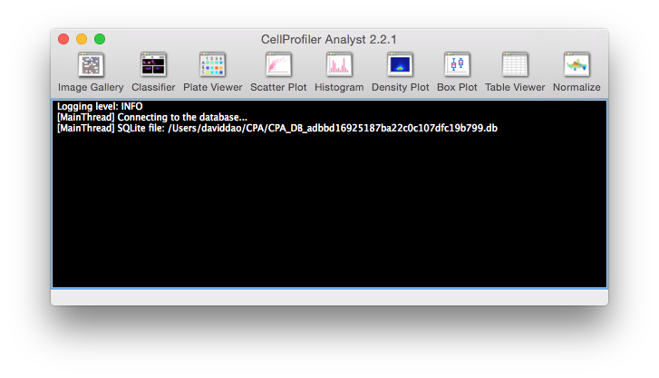

======================================
IV. The CellProfiler Analyst Interface
======================================
To run CPA, double-click the CPAnalyst.exe file on Windows or CPAnalyst.app on Mac OS. Once you have selected a properties file to load, the following small window will appear.

	CellProfiler Analyst main window.

This window provides a toolbar at the top with icons to launch each of CPA’s tools. The currently available tools are Image Gallery, Classifier, Plate Viewer, Scatter Plot, Histogram, Density Plot and Table Viewer. These tools can also be launched from the Tools menu. More tools will be added to this suite in the future.

Below the toolbar is a logging console that all the tools will use to provide feedback on status, warnings, etc. This console can be configured to display messages at 5 levels of verbosity chosen from the Logging menu. In order of increasing verbosity, these are:

- Critical: Virtually no messages. Will only report critical errors.
- Errors: Only reports error messages.
- Warnings: Only reports warnings and error messages.
- Info: Reports general status information as well as any warnings and errors.
- Debug: Reports technical information such as SQL queries in addition to all other messages listed above.

You can also optionally disable logging of image loading events by using the "Log image loading" toggle in the logging menu.

You can save the log to a file by selecting File > Save Log, or copied by selecting the text and using Ctrl+C (or your operating system default copy command).

You will also find menu items to save and load workspaces under the File menu. See Section XIII for more on workspaces in CPA and how they can help you analyze new data more quickly.

SQL query tool
--------------

The advanced menu provides a SQL query tool for writing SQL statements to query 
the DB

	Querying for all unique genes in per_image table

	Result of the query above for cpa_example dataset

