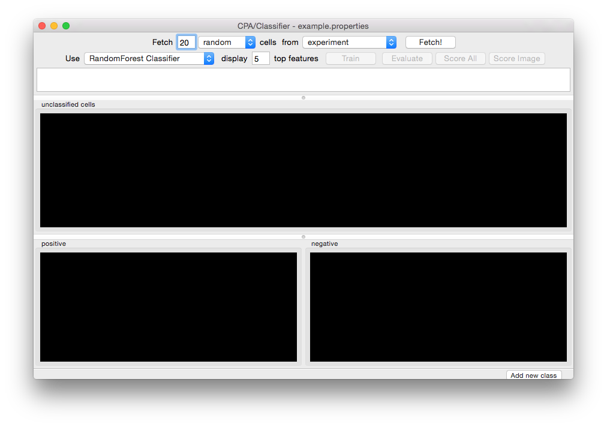
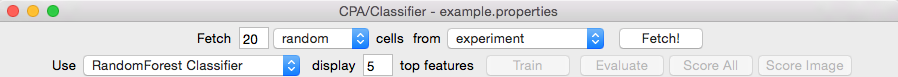
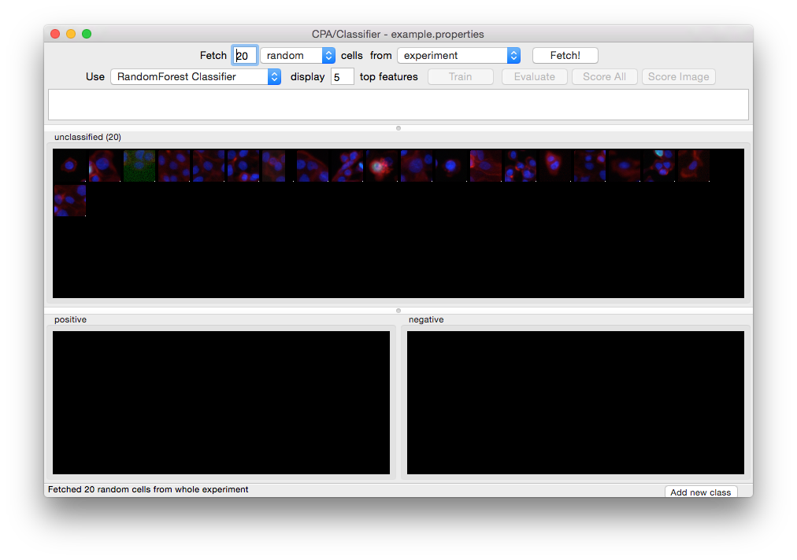
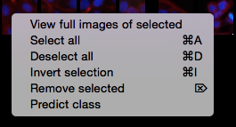
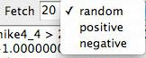

======================================
V. Classifier
======================================

Classifier allows you to train the computer to identify objects of interest by applying iterative,
user-supervised machine learning methods to object measurements.

You first request (**Fetch**) object tiles (cropped from their original images), then manually sort
them into classification bins (representing object classes), to form an annotated set. Once each bin
contains several example objects, you can start training Classifier on the annotated set, i.e., asking the machine to learn how to
differentiate the classes. Once Classifier is trained, you can
continue training by fetching and sorting either more random objects or those objects
that Classifier scores as being in a particular class;
by fetching the objects predicted by Classifier to belong to a certain class and correcting errors in these classifications, subsequent Classifiers rapidly improve. Usually several
rounds of refinement are necessary to train Classifier to recognize the
classes of interest.

Once classification reaches a desirable accuracy, Classifier can “score” your experiment. This
entails classifying all objects, counting how many objects of each class are in each image or
group (if you have defined groups in your properties file; see section II.G), and computing the
enrichment/depletion of each class per image or per group.

V.A Classifier quick-start guide
=================================

1. Launch Classifier and enter the number of objects you want Classifier to fetch.

2. Specify whether Classifier should select these objects from the entire experiment, a single image or a group, and whether it should apply any filters. Groups and filters will only be available if defined in your properties file (section II).

3. Click **Fetch**. Objects will appear in the Unclassified bin.

4. Manually sort the unclassified objects into classification bins, adding additional bins if needed. Often, two bins are used: **positive** and **negative**.

5. Enter the maximum number of rules you want Classifier to look for and click **Find Rules**.

6. Repeat steps 2–6 to fetch and sort more objects until you are satisfied with the rules Classifier has generated. With a rule set established, you will be able to specify that Classifier only retrieve objects that it deems to be in a particular class so that you can correct errors. Classifier’s rules for each class will become more refined with each iteration of this process.

7. Click **Score Image** to visualize object classifications in a particular image (you will be asked to enter an image ID number). Objects can be dragged and dropped into bins from the Image Viewer to further refine rules.

8. It is important to save the training set for future refinement, to re-generate scores, and as a record of your experiment. It is advisable to do so before proceeding to scoring your experiment since scoring may take a long time for large screens. Select File > **Save Training Set** from the menu bar (or **ctrl+S**).

9. Click **Score All** to have Classifier score your entire experiment (optionally with groups or filters). Classifier will present the results in a Table Viewer (described in section IV).

10.  You can click on column headings to sort the data by that column, helping you identify images that are highly enriched in a given object class, or images that simply have a high count of those objects. You can double-click the headers of rows to view the corresponding images and then drag and drop objects from the resulting image(s) into classification bins to further refine rules.

11.  You can save Classifier’s scores for each image (or group) from the Table Viewer using File > **Save data to CSV** or **Save per-image counts** to CSV to create comma-separated value files. You can also view the scores with CPA’s visualization tool, Plate Viewer, by using **Database > Write Temporary Table in Database** and running the Plate Viewer (section IV).

V.B In-depth guidance for using Classifier
==========================================

.. note::
    We recommend running only a single instance of CPA 2.0 at any one time. Otherwise, significant delays in processing may result, particularly if you are working with very large training sets and/or data sets.

V.B.1 Configuring Classifier
----------------------------

Launch Classifier by clicking the Classifier icon in the CPA toolbar. The main Classifier screen will appear. If you have previously saved a training set, you can load it using **File > Load Training Set:**

  Initial Classifier screen.

*Adding, Deleting, and Renaming Bins*
*************************************

- **Tip:** Use as few bins as necessary for the relevant downstream analysis; adding too many bins can decrease the overall accuracy.

To add more bins at any time, click the **Add new class**. button in the extreme lower right-hand corner of the window. You will see the **Rename class** popup window:

  Adding a sorting bin.

Right-clicking inside any bin displays a popup menu that contains a number of options, including **deleting** and **renaming** bins. The remaining options in this menu apply to the *contents* of the 17 bin. See section III.C.3 for more information.

.. figure:: static/05_04.jpg
  :align: center

  Right clicking on a sorting bin.

*Adjusting the display*
***********************

The menu bar at the top of the screen contains options for adjusting the display of the image tiles that will be displayed.** View > Image Controls** will bring up the same control panel found in the **Image Viewer** tool (section V), and the **channel menus** can be used to map different colors onto the respective channels. (**Actin**, **pH3**, and **DNA**, in this example; named so in the properties file as described in section II.)

  Classifier menu bar.

V.B.2 Fetch an initial batch of objects
----------------------------------------
Objects are fetched (retrieved) using the top portion of the main Classifier window:

  Controls to fetch objects.

*How many objects*? Enter the number of objects you want Classifier to fetch (default = **20**)

*Which class of objects should be retrieved*? At this stage, **random** will be the only option available in the left-hand menu. After you ask Classifier to **Find Rules** (section III.C.5, following), new options will appear corresponding to each classification bin.

*From which images?* **Experiment** and **image** are the two system-supplied default values in the right-hand menu. Select **experiment** to have Classifier retrieve objects from your entire experiment; select **image** to retrieve objects from a particular image (you will be asked to type 18 its ID number from your image table). If you want to fetch objects from particular subsets of images in the experiment (e.g., control samples), you can set up filters and groups of images by defining them in your properties file (described earlier in section II.G); these **filters** or **groups** will be available for selection here.

Click the **Fetch** button (located next to the right-hand menu) when you are ready to proceed, and you will see results like this:

  Twenty unclassified cells have been fetched and are ready for initial sorting.

V.B.3 Sort the initial batch of objects
----------------------------------------

Use your mouse to drag and drop object tiles into the classification bins you configured in step
III.C.1. If you are uncertain about the classification of a particular object, it can be ignored or
removed by selecting it and pushing the Delete key. Keep in mind, however, that classifier will
ultimately score ALL objects found in your table unless you define filters to ignore certain
images (see section II.F).

**Important:** A small dot is displayed in the center of each tile as your mouse hovers over it. The
object that falls under this dot is the object that must be sorted. In the example below, the tile
under the mouse should be sorted based on the blue cell underneath the dot, NOT the cells
surrounding it. To change cropping size of the tile “window”, adjust the field ``image_tile_size`` in the properties file (section II.D).

.. figure:: static/05_07.jpg
  :align: center

  The object to be sorted is indicated by a small dot.

Once you have placed tiles in at least two bins, you have created Classifier’s initial **training set**,
which will be used to generate rules to differentiate objects in different classes.

- **Tip:** Clicking on a tile will select it. Holding shift will allow you to add and remove tiles from the selection. All the tiles in a selection can be moved at once by dragging one of them to another bin.

Some helpful tools are available when you right-click on a tile:

  Right-clicking on a tile.

- Select **View full images of selected** or double-click an individual tile to show the object in the context of the image from which it was drawn. This launches the **Image Viewer** tool (section V)

**Tip:** Objects can dragged and dropped from the Image Viewer into class bins just as they are from the bins themselves. Use Shift+click to add/remove multiple objects to/from a selection, and ``ctrl+A/Ctrl+D`` to select/deselect all objects in the image

- **Select all/Deselect all** (``ctrl+A/ctrl+D``) selects/deselects all tiles in the bin so they can be dragged and dropped together.

- **Invert selection** (``ctrl+I``) to invert your selection (that is, select all non-selected tiles in the current bin and deselect all selected tiles).

- **Remove selected** (``Delete``) removes the selected tiles from the current bin.

V.B.4 Saving and loading training sets
----------------------------------------

Objects sorted into the bins are known as the **training set**. You can save the training set at any time, allowing you to close CPA and pick up where you left off later by re-loading the training set. Save and load training sets using **File > Save training set or File > Load training set**.

**Warning**: Loading a training set will cause all existing bins and tiles to be cleared.

V.B.5 Find rules / training Classifier
---------------------------------------

When you have finished your initial sorting, enter the maximum number of rules you want Classifier to find (default = **5**).

- During initial training, it is best to use a small number of rules (5-10) to make sure that you do not define your phenotype too narrowly. That is, you want to identify a wide variety of objects that represent your object class but differ in their other characteristics.

- As training proceeds, you may want to increase the number of rules to allow Classifier to capture more subtle distinctions between classes.

- Using more rules does not always result in greater accuracy.

- Increasing the number of rules above 100 is unlikely to improve classification accuracy. Although there is little risk of over-fitting with this machine learning method, too many rules wastes calculation time, since this is an intensive step.

- For complex object classes (that is, to the human eye, one that involves the assessment of many features of the objects simultaneously), we recommend ultimately using **50** rules, based on our experience with 14 phenotypes in human cells (Jones, T.R., et al., PNAS 2009).

- **SQLite Limitation**: With our current implementation, SQLite limits the number of rules that can be used depending on how many classes you have. E.g.: For 2 classes, no more than 23 rules can be used, for 3 classes, no more than 18.

Click **Find Rules**. You will note that the large text field near the top of the screen contains the initial rules Classifier has identified based on the objects you deposited into the bins, as a series of IF statements:

.. figure:: static/05_09.jpg
  :align: center

  Classifier, after finding rules. In this example, 5 rules were found out of the specified maximum of 5.

Usually the number of rules shown in the window is equal to the maximum number you selected, unless fewer rules are able to achieve perfect classification of the training set.

At this point, your goal is to refine the rules by adding more objects to the training set. You can continue to fetch objects at random, but note that the left-most drop-down menu in the fetch controls (top part of the window) now lists the classes that you have trained Classifier to recognize. This allows you to fetch objects that Classifier deems as belonging to a particular
class. Correcting for misclassified objects by sorting them into the appropriate bins and retraining will help you to rapidly improve the accuracy of Classifier’s rules.

  Object class selection options.

Continue repeating the process of finding rules, fetching objects, sorting them into their appropriate classes, and finding more rules. Scoring (section III.C.6, following) can be used when you have finished creating a **training set** (that is, you are satisfied by its performance), but note that, as described later, scoring can also be used as another iterative step in creating the training set.

*Assessing accuracy*
**********************

The most accurate way to gauge Classifier’s performance is to fetch a large number of objects of a given class (e.g., positive) from the whole experiment. The fraction of the retrieved objects correctly matching the requested phenotype indicates the classifier’s general performance. For
example, if you fetch 100 positive objects but find upon inspection that 5 of the retrieved objects are not positives, then you can expect Classifier to have a positive predictive value of 95% on individual cells (and similarly for negative predictive value in the case of two classes). Note that sensitivity, specificity, and negative and positive predictive values must be interpreted in the context of the actual prevalence of individual phenotypes, which may be difficult to assess a priori.

The **Evaluate** button calculates cross-validation metrics given the annotated set. Values closer to 1 indicate better performance. The cross-validation is 5 fold, and for each fold, the annotated set is split into a training and testing set (the split is stratified, meaning class proportions remain intact) and the algorithm is trained on the training set, then evaluated on the test set. To get final values, the evaluations are averaged over all folds. The evaluation can display a classification report, which is the recall, precision, and F1 score per class, or a confusion matrix, which is a matrix where the element in row i, column j has true class i and predicted class j.

Another way to gauge the classifier’s performance is to use the **Score Image** button on positive
and negative controls (see the following section). **Score Image** allows you to see qualitatively
how Classifier performs on a single image. Although the results cannot be reliably extrapolated
to other images, it can be useful to examine control images and further refine the rules by
adding misclassified objects in those images to the proper bins.

The relationship between accuracy on individual cells versus performance scoring wells for
follow-up is complicated, because false positive and false negatives are not evenly distributed
throughout an experiment. In practice, improving accuracy on individual cells leads to better
accuracy on wells, and in general, the accuracy on wells is better than the per-cell accuracy.

V.B.6 Scoring
-------------

*Score image*
*************

Scoring a single image can be useful in several ways:

- You can display an image and rapidly identify and correct classification errors in the image, by dragging and dropping objects from the image into bins.

- You can use it as visual feedback to verify your classifier’s accuracy on a given image (especially a control image) at any point in the training process.

- You can also use it to check Classifier’s classifications for individual images with unusual scores displayed in the Table Viewer produced by **Score All** (described in the next section).

To score a single image qualitatively, select **Score Image** and enter an image number.
Classifier displays the image in **Image Viewer** (described in section V), with objects marked
according to their classifications, based on the rules most recently found by Classifier. To save
the resulting image as either a .jpg or .png file, select **File > Save Image** from the menu bar (or
shortcut **Ctrl+S**).

.. note::
    **Note**: This function is not yet capable of saving the classification markings.

  Scoring an image: Identifying classes by color (blue and yellow squares, left) and by number (right). Note that we have chosen to hide the blue channel (DNA stain) while viewing these images.

To display the object classes by number rather than color, select **View > View object classes
as numbers** from the menu bar.

  The Image Viewer control panel after scoring an image.

The brightness, contrast, and zoom controls work exactly as described for **Image Viewer**
(section V). Note, however, the two checkboxes under **Phenotypes**: you can now
select/deselect **positive** and **negative** results to display or hide only these objects in the image
as requested.

*Score all*
************

Click **Score All** to classify all objects in your database using the current rule set. It can be
helpful to score all images in the experiment and open some of the top-scoring images with
**Score Image** to check classification accuracy. Rules can be further refined by dragging and
dropping objects from the image into bins in order to correct classification errors in images.

The result of **Score All** is a table of object counts and enrichment values for each classification
you defined. You can then sort by these columns to find images (or groups, e.g., wells as
collections of images) that are enriched or depleted for a particular classification, based on
object counts or enrichment scores (see figure below for details).

  Description of enrichment score calculation. (A) While machine-learning methods are used to produce per-cell scores,  the challenge remains to model the sample distributions to generate a per-sample enrichment score. (B) Samples with  varied positive/negative counts can be viewed as being drawn from a Beta distribution. (C) The full population is treated  as independent samples to yield C = Beta(, ) which is used as the full-population-level prior for future observations.  This prior is updated with new observations by computing the distribution of the positive fraction as the posterior T =  Beta( + npos,  + nneg), where npos and nneg are the positive and negative counts, respectively. The enrichment score for  each sample is then calculated as the logit of P(T > C).

**Note**: *Enrichment* scores are computed for each sample as the logit area under the ROC curve
for the prior versus the posterior distribution. The prior is computed from the full experiment
using a Dirichlet-Multinomial distribution (a multi-class extension of Beta-Binomial) fit to the
groups, and the posterior is computed for each group independently; that is, each
phenotype is treated as positive and all others as negative for each phenotype in turn.
-
**Tip**: In most cases results should be ranked by enrichment score because this score takes into account both the number of objects in the class of interest as well as the total number of objects in the group.

If you have defined any groups or filters in your properties file, you will have the option to select
them here for use in scoring. If no groups or filters are defined, the window will contain only the
default group **Image** and the default filter **None**.

  Classifier group/filter selection window.

Classifier presents its results in the **Table Viewer** tool, described in the next section. The table
shows object counts and enrichment values for each phenotype you trained Classifier to
recognize. To view this information graphically, return to the main Classifier screen and select
**Tools > Plate Viewer** from the menu bar (see section VI for details).

  Enrichment Table Viewer produced by Classifier. Here we have grouped the counts and statistics on a per-image basis. We have ordered the data by the “Enriched Score Positive” column. The most highly enriched images were  172, 171, 169, and 170. With the “Positive Cell Count” column selected, we can see in the status bar that there are a  total of 2331 positive cells in our experiment, with a mean of 6.07 positive cells per image, and a standard deviation  of 7.74.
