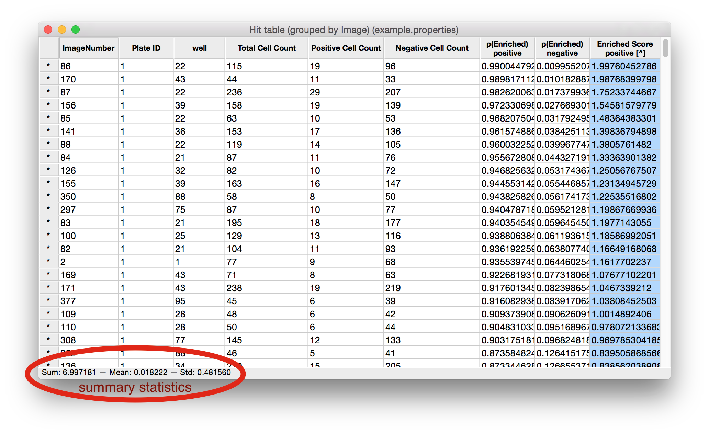

================
VI. Table Viewer
================
Certain tools, such as Classifier, produce a table that will be opened in the Table Viewer. As well, any CSV file or database table can be viewed by using this tool.

  Table Viewer produced by Classifier, grouped by well number and gene (only positive Enrichment Score column).

Features available in the Table Viewer
--------------------------------------

- **Sort**: Click on any column heading to sort the data based on that column. Click again to reverse the sort. To sort by more than one column (i.e., sort first by column X, then by column Y), click on the first heading of the first column you want to sort by, then hold shift and click on the next column heading. You can add any number of columns to a sorting in this way. Sorting order and direction is indicated in brackets at the end of the header name by a number and an arrow (^ or v). Clicking on any column header that is already part of a sorting will reverse the direction of the sort. Pressing shift+click on a column header that is already part of a sorting will remove that column from the sorting.
- **Show images**: Double-click on a row header to show the image or images in that row’s group. Right-click to see a list of the image-keys in that row and click one to open it.
- **View summary statistics**: Click anywhere within the table to select a column. A summary of statistical information about the selected column(s) is displayed in the status bar at the bottom of the window. You may select multiple columns by pressing ctrl+click (cmd+click on a Mac).
- **Show/hide columns**: To select which columns are shown in the Table Viewer, select View > Show/hide columns and a dialog will appear with a list of columns. Check off the columns that you wish to show, and uncheck the column that you want hidden.
- **Saving and loading CSV files**: CPA can read and write CSV (comma-separated value) files by selecting File > Load table from CSV or File > Save table to CSV. When saving a table it’s important to note that columns that were hidden (see above) will not be written to the CSV.
- **Saving and Loading database tables**: Table Viewer can also load and save database tables. This means you can easily open a CSV file in Table Viewer and then store that table in your database for plotting and analysis in CPA. Conversely, you can load a database table into Table Viewer (such as your per-object table), and save it on your computer as a CSV. As with CSVs, saving and loading from the database can be done via File > Load table from database and File > Save table to database. Note, when saving a table to the database, you will be prompted whether to store the table permanently or "for this session only" – which means the table will be removed from the database when you close CPA.

.. note::
    When saving a table to the database, you will be prompted whether to store the table permanently or "for this session only" – which means the table will be removed from the database when you close CPA.
