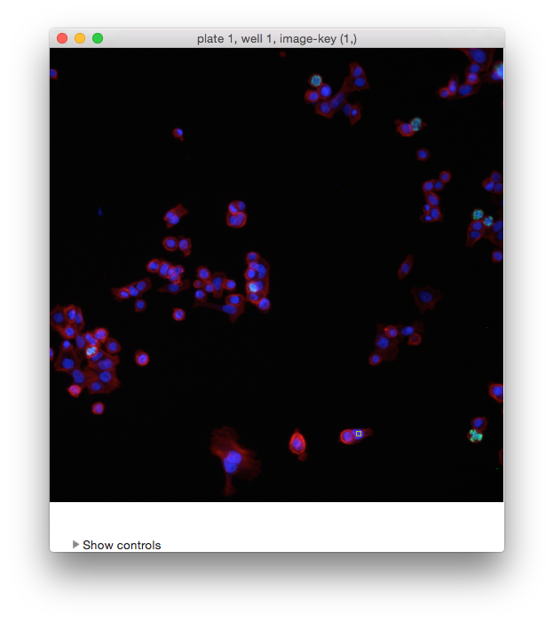

=================
VII. Image Viewer
=================

Certain CPA tools, such as **Classifier**, display images in **Image Viewer**, and any image in the
experiment can also be opened within CPA by choosing this tool from CPA’s **Tools** menu or by
clicking the **Image Viewer** icon in the toolbar.

  The Image Viewer.

When you open Image Viewer from CPA, it will prompt for the ID number of an image to show. If
you also specified a ``table_id`` column in your properties file, then you will also be prompted for
the table number. You can load additional images by selecting **File > Open Image (ctrl+O)**.

If you specified ``plate_id`` and ``well_id`` in your properties file, then Image Viewer will display
the plate and well in the title of the window along with the image-key, which is image 328 in the
example above.

The ``image_names`` that are specified in your properties file will appear in the menu bar. In the
example above, the user has specified names for the **Actin**, **pH3**, and **DNA** channels. If you
have not defined names for any channels, the menu bar will contain **channel-1**, **channel-2**, etc.

Click on one of the channel names to see a dropdown list of available colors for each – clicking
on a color will map that color onto the channel. If you specified ``image_channel_colors`` in
your properties file, those colors specified there should appear under each channel menu by
default.

The Classifier menu provides an item that will let you classify the objects in the current image.
This item is only enabled if Classifier is running and trained. For more
on this feature see the **Score image** discussion in section III.C.6.

- **Tip**: You can use keyboard shortcuts to toggle each channel on/off: Ctrl+1, +2, +3, … will toggle first, second, third, etc. color channels.

Click **Show controls** (or press the space bar) to display the Image Viewer control panel, which
controls brightness, contrast, and scale. This same control panel is available in Classifier by
choosing **View > Image Controls** (see section III.C.1).

  Image controls

The upper slider controls brightness; the lower one rescales the size of the image or image tiles.
The **Contrast Stretch** controls let you stretch the image contrast by rescaling the pixel
intensities of each channel independently to fit the range 0-1 (where 0 is unsaturated and 1 is
saturated).

- **Linear** scales the image intensities linearly. For an image in the range 0-0.5, pixels at 0.5 intensity would be rescaled to 1.0, and pixels at 0.4 rescaled to 0.8; in short, all pixel intensities in the image would be doubled.

- **Log** transform scales the image intensities logarithmically, which has the effect of scaling dimmer pixels by a greater factor than it scales brighter pixels.

**Warning**: scaling in this way may yield misleading results. For example, if a channel of an
image shows very little staining, the raw image may have intensities in a low, narrow range,
e.g., from [0-0.01]. Stretching in this case would have the effect of raising the background
intensity levels so that the image overall appears very bright.
