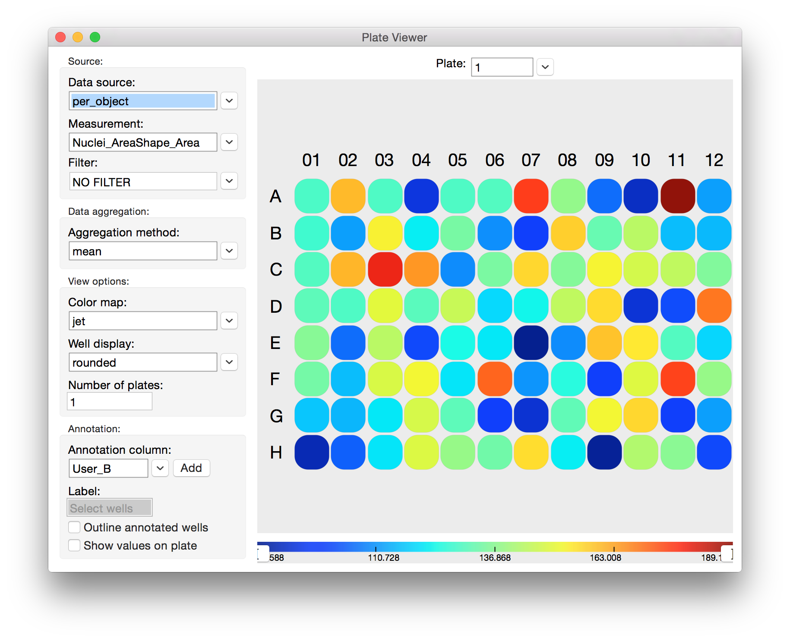

==================
VIII. Plate Viewer
==================

Plate Viewer is a tool for browsing image-based data laid out on multi-well plates common to
high-throughput biological screens. Supported formats are:

- **96 well plate** — 8 rows x 12 columns
- **384 well plate** — 16 rows x 24 columns
- **1536 well plate** — 32 rows x 48 columns
- **5600 spot microarray** — 40 rows x 140 columns

To launch this tool click the Plate Viewer icon in the CPA toolbar or select **Tools > Plate Viewer**
from the CPA menu bar.

Sample Plate Viewer for a single 96-well plate, viewing the mean positive enrichment score output by Classifier. We can see that well D07 is very highly enriched for our "positive" cell phenotype.

.. note::
		An **X** in one of the wells means there was no data in the database corresponding to that particular well. However, it may still contain images that can be viewed, as described below.

In the colored plate display, right-clicking on a well will display a list of image-keys found in that
well. Selecting one image-key will open that image in the **Image Viewer** (section V). Doubleclicking
on a well will open all images from that well, each in its own Image Viewer.

Above the plate is a menu that lets you specify the plate number to display. Holding the cursor
over a particular well will display a tooltip showing the value pertaining to that well.

The left-hand column contains many options for generating different views into your data.

- **Data source**: Allows you to select a table for visualization. You cannot load a CSV directly into the Plate Viewer. You must open the CSV in Table Viewer first, save it to the database, and then open it in Plate Viewer.
- **Measurement**: The column from the selected table that you would like to visualize.
- **Aggregation Method**: Measurements must be aggregated to a single number for each well so that they can be represented by a color. Options are **mean**, **sum**, **median**, **standard deviation**, **cv%** (coefficient of variation), **minimum**, and **maximum**. If you’re viewing ``object_count`` from the image table, for example, you might select **sum** to visualize the sum of the object counts for all images that constitute a well.

    **Important**: Plate Viewer is agnostic with regard to the type of data it aggregates, so viewing columns from the image table will not cause the viewer to access any data from the object table. For example, a biological screen with 4 images (sites) per well may be analyzed in CellProfiler, and cell measurements may be aggregated to each image and output to the image table. One column grom the table, ``Image_Intensity_DNA_Mean_ Intensity``, could be visualized in Plate Viewer and aggregated from each image to each well by, say, the **maximum** option. This could be mistakenly thought to be reporting the maximum DNA intensity value of any cell from that well, when it is actually reporting the maximum of the mean per-image DNA intensity per-well.

- **Color Map**: Each value computed by the Aggregation Method is mapped to a color via a color map. The currently selected color map is represented in a bar beneath the plate maps. More than 50 color maps are available.
- **Well Shape**: Mostly for presentation purposes, you can select from different well shapes. Options are **square**, **rounded**, **circle**, and **image**.

    Important: The "*image*" feature is still under development. This will display a
    rescaled image from each well in the place of the well itself. This can take a very
    long time to refresh since full sized images must be loaded for every well in view. For
    it to be useful, viewing 1 plate at a time and maximizing the window is advised. Note:
    that the color map is irrelevant when using this view.

- **Number of Plates**: Enter the number of plates you would like to view at once, and press the Enter or Return key.

Here is a four-plate view of the same experiment shown in the previous example, in which the user has chosen to view the mean of the per-object measurement *Spindle_AreaShape_Area* in each well across 4 plates.

	Viewing four 96-well plates at once in Plate Viewer. Here we are visualizing the mean Spindle_AreaShape_Area in each well. This makes it easy to visualize many thousands of object measurements in a meaningful way.

	Viewing the sums of the per-object measurement tubulin_AreaShape_Area in each well of a single 384-well plate in  Plate Viewer. Notice that while well C01 has the largest tubulin area (62406) in this plate, the color bar indicates that  the largest value of this measurement in the experiment is 91617, which must be in some other plate.

The color bar axis at the bottom of the window shows how the aggregated values of the selected measurement column map to colors:

- The numbers at the far left and right of the axis represent the minimum and maximum values found in the entire experiment.
- The value range of the current plate(s) extends to the point where the color bar stops and a thin black line begins.

To assist in visualizing data, particularly when there are extreme outlier data points, you can
**rescale** or **clip** the color bar by dragging the handles found at the far ends of the bar.

- **Color rescaling**: This will rescale the full color map to fit within the minimum and maximum values at the handles. Values below the range are mapped to the minimum (leftmost) color, values above the range are mapped to the maximum (rightmost) color.

- **Color clipping**: As with color rescaling, this will map values below the range to the minimum color, and values above the range to the maximum color. However, the full range of colors will not be rescaled to fit within the handles, it is cropped or “clipped.”

To change the mode from rescaling to clipping, right click on the bar and select **Value
bracketing: CLIP**, to change it back to rescaling, do the same and select **Value bracketing:
RESCALE**. To set the sliders back at the global min and max, select **Reset sliders**.

	Selecting Color Bar options.
