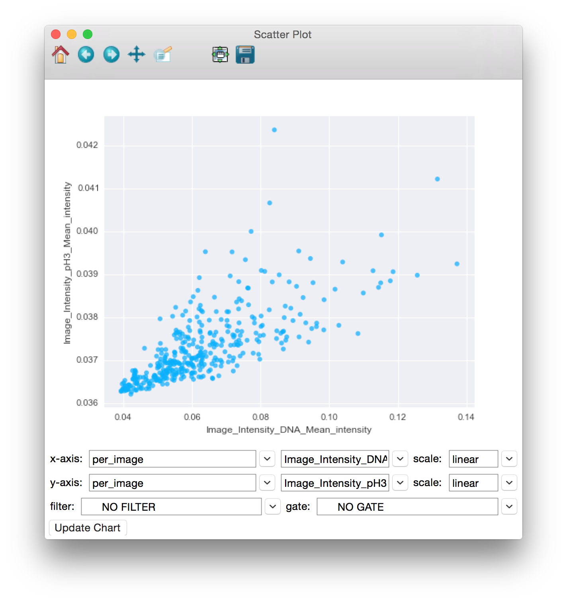

================
IX. Scatter Plot
================

Launch **Scatter Plot** from the main CPA interface by clicking the button in the toolbar. This tool
will allow you to create scatter plots from the numeric columns in your tables.

Using Scatter Plot to visualize the relationship between the Image_Intensity_DNA_Mean_intensity and the Image_Intensity_pH3_Mean_intensity image measurements.

To use the **Scatter Plot**, simply select the table whose columns you would like to plot from the
table dropdown. Then select measurements from that table in the x-axis and y-axis dropdowns
(only numeric columns will be available). To view an axis in the log scale, choose **log** from the
x-scale or y-scale dropdown. The filter dropdown can be used to select filters defined in your
properties file to limit the points being plotted. Finally, click the **Update Chart** button to view the
plot.

.. note::
		Update may take a long time or even fail for large databases. We are working to improve this performance in later releases.

Once data is plotted, you can use the tools provided in the toolbar at the top of the window to
37
explore the plot. Going backwards from right to left, the tools are as follows:

- **Save**: Clicking this will give you choices for saving the plot as an image.

* **Zoom-to-rect**: This tool may be toggled on and off. When it is on, you can use the mouse to click and drag a rectangle to zoom in on. The extents of the rectangle will become the new extents of the axes. Use the Back button (below) to zoom back out.

- **Pan**: This tool may also be toggled. When on, you can use the mouse to pan the axes by clicking and dragging.

* **Forward** and **Back**: These 2 buttons will redo and undo the zooming and panning actions that you make

- **Home**: This will reset the view to the way it was after Update Chart was pressed

**Selection**:
When the pan and zoom tools are toggled off, the default action of the mouse is to draw a
freeform selection. You can add to an existing selection by holding the shift key while drawing a
new shape. Likewise, you can subtract from a selection by holding alt and drawing a selection
around the points you wish to deselect.

**Viewing Images**:
You can view the images from a selection by right-clicking on the plot and selecting “Show
images from selection” from the resultant popup menu. This will pop up a list of the selected
image keys along with their plate and well information (if specified in your properties file).
Double clicking on an image entry will launch that image in the **Image Viewer** tool.
